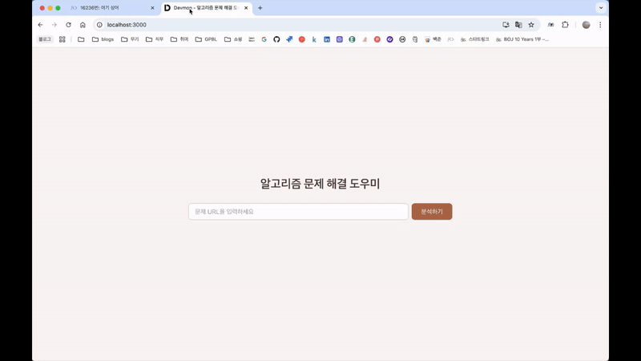
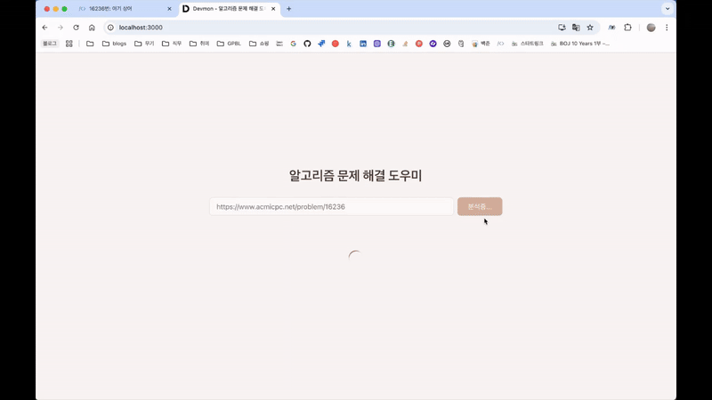

# Kookmin univ. G-PBL(Global Problem Based Learning)

국민대학교 G-PBL 프로그램 중 LLM 수업 시 제작한 프로젝트입니다.

## 프로젝트 소개

- **프로젝트 이름** : Devmon (Developer + 구몬)
- **프로젝트 개요** : 궁금한 백준 문제의 url을 제공하면 코딩테스트 문제의 해설을 제공합니다.
- **주요 대상** : 코딩테스트를 공부하는 학생
- **기존 문제점** : 코딩테스트 공부 시, 해설이 존재하지 않아 한 문제를 풀지 못하면 풀 때까지 붙잡고 있어야 함.
- **해결하고자 한 부분** : 학습지의 해설지처럼, 문제를 풀기 위해선 어떻게 접근해야 하는지에 대해 알려주고 싶었음.

## 팀 소개

- **[김동연](https://github.com/0yeonnnn0)**: Full-Stack Developer
- **[김민종](https://github.com/manjong-bot)**: Frontend Developer

## Demo 및 사용법

[데모 영상 보기](https://www.youtube.com/watch?v=Jj12vxyym_8) <br>

1. 유저는 백준 문제의 링크를 제출합니다.



2. 문제에 대한 해설을 제공합니다.<br>
   해설 내용으로 이하 내용을 제공하고 있습니다.
   - 권장 알고리즘
   - 알고리즘 설명
   - 풀이 접근 방법
   - Pseudo Code
   - 실제 코드(Python)
   - 코드 설명
   - 시간 복잡도
   - 해당 알고리즘으로 풀 수 있는 다른 문제 5가지



## 설치 및 실행

이전에 [백엔드 코드](https://github.com/0yeonnnn0/devmon_be)의 설치 및 실행이 완료되어 있어야 합니다.

1. 리포지토리 클론

```
git clone https://github.com/0yeonnnn0/devmon_ft
cd devmon_ft
```

2. 필수 패키지 설치

```
npm install
```

3. 개발 서버 실행

```
npm start
```

4. 웹 브라우저에서 열기

```
http://localhost:3000
```

## 기술 스택

- React
- Zustand
- tailwindCSS

## Contributing

Pull requests는 언제나 환영입니다! 중요한 변경 사항을 제안하기 전에 이슈를 열어 논의해 주세요.

1. 포크하기 (`Fork`)
2. 새로운 브랜치 생성하기 (`git checkout -b feature/your-feature`)
3. 커밋하기 (`git commit -m 'Add some feature'`)
4. 브랜치 푸시하기 (`git push origin feature/your-feature`)
5. Pull Request 보내기

## Contact

프로젝트 관련 문의는 [angrybird2600@gmail.com](mailto:angrybird2600@gmail.com)로 보내주세요.

GitHub: [0yeonnnn0](https://github.com/0yeonnnn0)  
LinkedIn: [your-linkedin](https://www.linkedin.com/in/dongyeon-kim-49b6852a6/)
